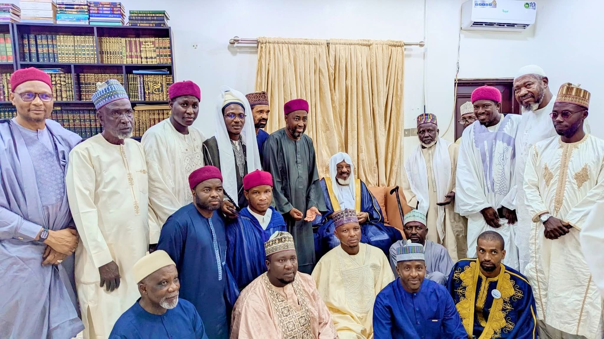
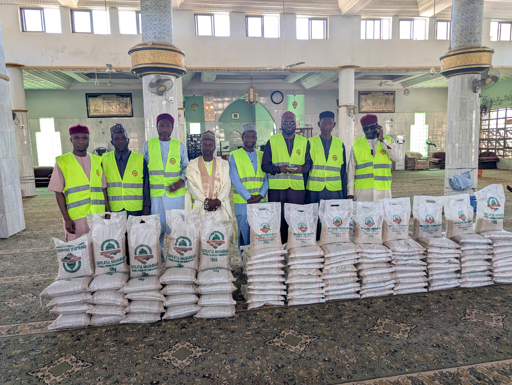
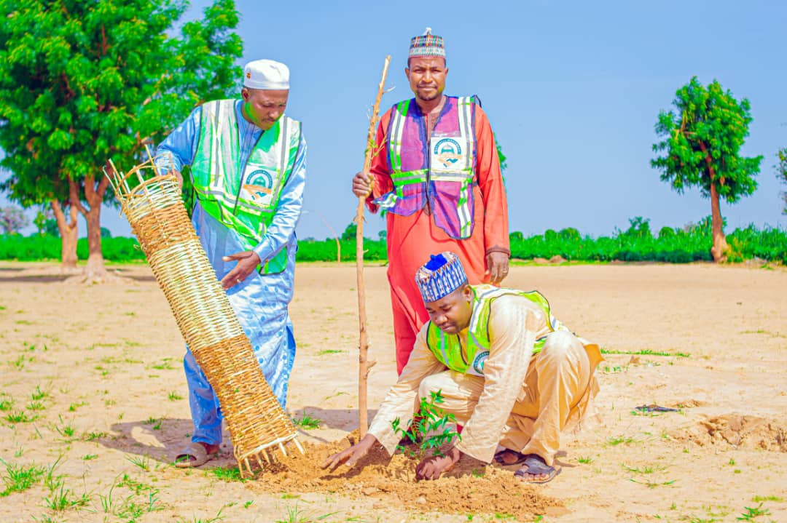
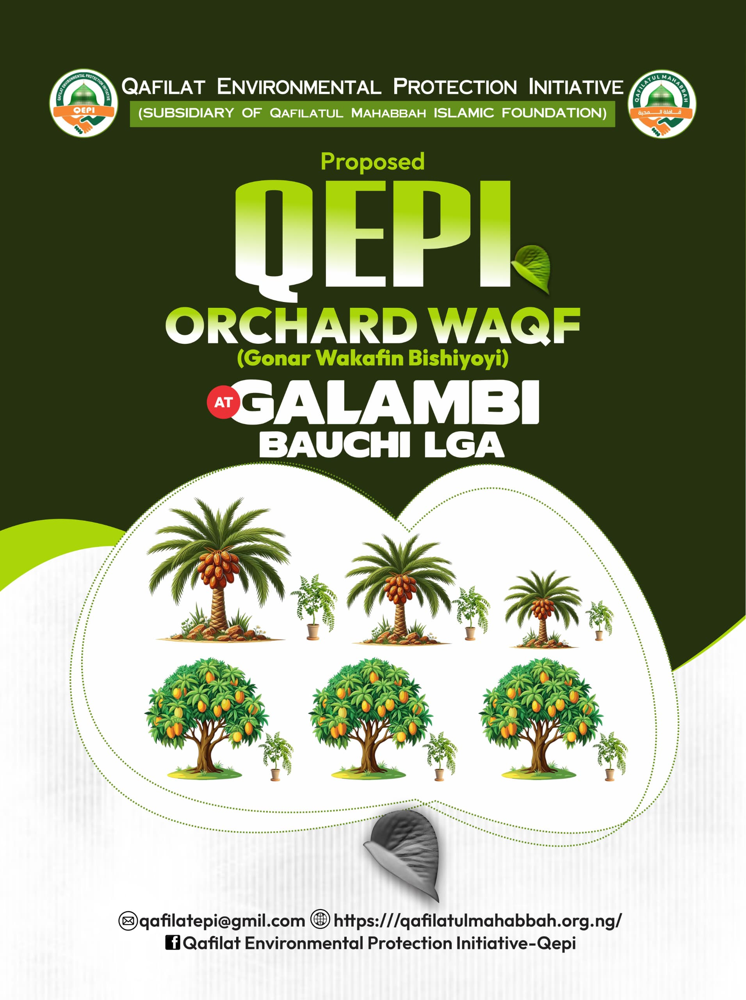

# Qafilatul Mahabba Web Platform

An interactive community outreach and donation platform built to support local humanitarian initiatives, including orphan support, healthcare assistance, clothing distribution, and community feeding programs.

 <!-- Replace with a main screenshot or hero image -->

---

## Key Features

* **Donation & Support Channels:** Dedicated workflows for supporting orphans, medical assistance, and community outreach.
* **Dynamic Media Galleries:** High-performance image and video galleries showcasing field operations and distribution drives.
* **Program Directory:** Real-time information hub detailing active community programs and impact tracking.
* **Responsive UI/UX:** Modern, mobile-first design built with Tailwind CSS and custom component architecture.

---

## Tech Stack

* **Frontend:** Vue 3 (Composition API)
* **Build Tool:** Vite
* **Styling:** Tailwind CSS, Custom CSS
* **Routing:** Vue Router
* **Icons & Components:** Custom UI library (Radix/Shadcn-Vue primitives)

---

## Screenshots

| Homepage & Hero | Community Programs |
|---|---|
|  |  |

| Outreach Gallery | Support & Contact |
|---|---|
|  |  |

---

## Project Structure

```text
src/
├── assets/          # Images, videos, and global styles
├── components/      # Reusable UI components (Navbar, Hero, Footer, Cards)
├── layouts/         # Shared page layouts
├── pages/           # View components (Home, About, Programs, Support)
├── router/          # Vue Router configurations
└── lib/             # Helper functions and utilities